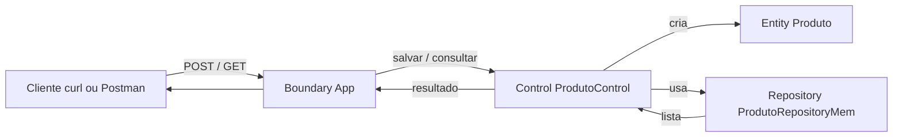
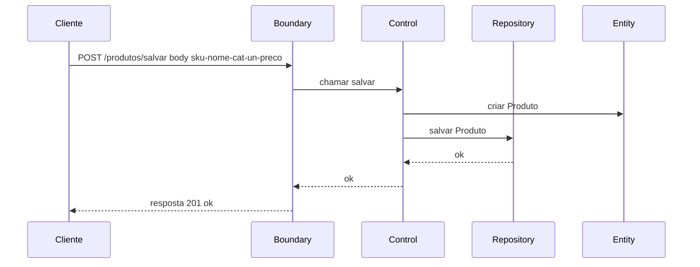
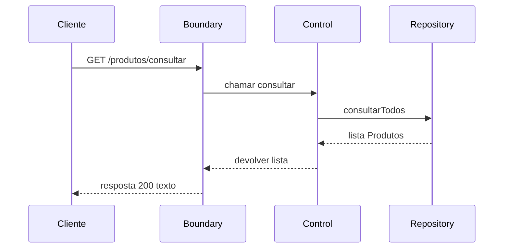
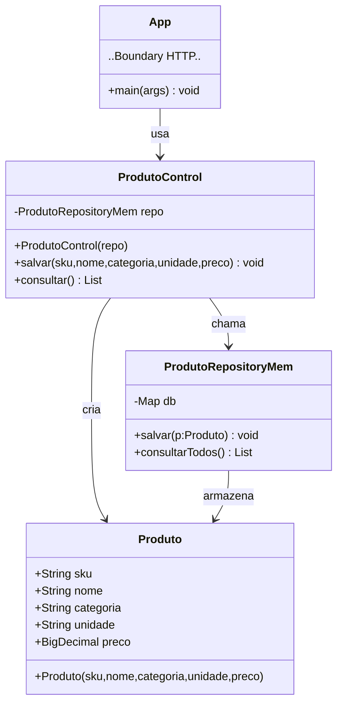

# Aula: BCE + R (memória) — salvar & consultar Produto (cada linha comentada)

Hoje vamos **fazer funcionar**: receber requisições HTTP para **salvar** e **consultar** produtos, usando **B**oundary, **C**ontrol, **E**ntity e **R**epository em memória.  
Tudo ultra simples. Cada linha de código está comentada para você entender exatamente o que acontece.

---








## Parte 1 — Estrutura de pastas

```
src/
 ├── App.java                   // Boundary (HTTP) — nossas rotas
 ├── Produto.java               // Entity — dados do produto
 ├── ProdutoRepositoryMem.java  // Repository — “banco” em memória
 └── ProdutoService.java        // Control — orquestra salvar/consultar
```

---

## Parte 2 — `Produto.java` (Entity) — **cada linha comentada**

```java
// Define a classe pública Produto (nossa "entidade" do domínio)
public class Produto {
    // Campo público 'sku' que identifica unicamente o produto (ex.: "MACA01")
    public String sku;
    // Campo público 'nome' para o nome do produto (ex.: "Maçã Gala")
    public String nome;
    // Campo público 'categoria' para agrupar produtos (ex.: "FRUTA")
    public String categoria;
    // Campo público 'unidade' para indicar a unidade de venda (ex.: "KG" ou "UNIDADE")
    public String unidade;
    // Campo público 'preco' que armazena o preço com precisão (BigDecimal)
    public double preco;

    // Construtor da classe Produto: recebe todos os campos necessários para criar um produto
    public Produto(String sku, String nome, String categoria, String unidade, BigDecimal preco) {
        // Atribui o parâmetro 'sku' ao campo 'sku' deste objeto
        this.sku = sku;
        // Atribui o parâmetro 'nome' ao campo 'nome' deste objeto
        this.nome = nome;
        // Atribui o parâmetro 'categoria' ao campo 'categoria' deste objeto
        this.categoria = categoria;
        // Atribui o parâmetro 'unidade' ao campo 'unidade' deste objeto
        this.unidade = unidade;
        // Atribui o parâmetro 'preco' ao campo 'preco' deste objeto
        this.preco = preco;
    }
}
```

---

## Parte 3 — `ProdutoRepositoryMem.java` (Repository em memória) — **cada linha comentada**

```java
// Importa utilitários de coleção: List, ArrayList, Map
import java.util.*;
// Importa um Map concorrente (thread-safe simples) para armazenar os produtos em memória
import java.util.concurrent.ConcurrentHashMap;

// Define a classe pública ProdutoRepositoryMem (nosso "repositório" em memória)
public class ProdutoRepositoryMem {
    // Cria um "banco" em memória: chave é o SKU (String), valor é o Produto
    private final Map<String, Produto> db = new ConcurrentHashMap<>();

    // Método público 'salvar' que recebe um Produto e o guarda no Map
    public void salvar(Produto p) {
        // Coloca o produto no Map usando o sku como chave (se já existir, substitui)
        db.put(p.sku, p);
    }

    // Método público 'consultarTodos' que devolve uma lista com todos os produtos
    public List<Produto> consultarTodos() {
        // Cria e retorna uma nova ArrayList com os valores (produtos) que estão no Map
        return new ArrayList<>(db.values());
    }
}
```

---

## Parte 4 — `ProdutoControl.java` (Control) — **cada linha comentada**

```java
// Importa BigDecimal para repassar preço ao criar produto
import java.math.BigDecimal;
// Importa List para o retorno da consulta
import java.util.List;

// Define a classe pública ProdutoControl (o "orquestrador" dos casos de uso)
public class ProdutoControl {
    // Mantém uma referência ao repositório em memória para poder salvar/consultar
    private final ProdutoRepositoryMem repo;

    // Construtor do Control: recebe o repositório que será usado internamente
    public ProdutoControl(ProdutoRepositoryMem repo) {
        // Armazena o repositório recebido no campo 'repo'
        this.repo = repo;
    }

    // Caso de uso "salvar": recebe dados crus, cria um Produto e manda salvar no repositório
    public void salvar(String sku, String nome, String categoria, String unidade, BigDecimal preco) {
        // Cria um novo objeto Produto com os dados recebidos
        Produto p = new Produto(sku, nome, categoria, unidade, preco);
        // Chama o repositório para persistir em memória o produto recém-criado
        repo.salvar(p);
    }

    // Caso de uso "consultar": pede todos os produtos ao repositório e retorna
    public List<Produto> consultar() {
        // Retorna a lista de todos os produtos armazenados no repositório
        return repo.consultarTodos();
    }
}
```

---

## Parte 5 — `App.java` (Boundary — servidor HTTP nativo) — **cada linha comentada**

```java
// Importa classes do servidor HTTP nativo do Java (HttpServer, HttpExchange, etc.)
import com.sun.net.httpserver.*;
// Importa classes para entrada/saída de dados (InputStream/OutputStream)
import java.io.*;
// Importa InetSocketAddress para definir porta/endereço do servidor
import java.net.InetSocketAddress;
// Importa StandardCharsets para converter String <-> bytes com UTF-8
import java.nio.charset.StandardCharsets;
// Importa BigDecimal para converter o preço recebido (texto) em número preciso
import java.math.BigDecimal;

// Define a classe pública App que terá o método main (ponto de entrada do programa)
public class App {
    // Método main: onde o programa começa; pode lançar IOException por operações de rede
    public static void main(String[] args) throws IOException {
        // Cria uma instância do repositório em memória (R)
        var repo = new ProdutoRepositoryMem();
        // Cria uma instância do control (C) e injeta o repositório nele
        var control = new ProdutoControl(repo);

        // Cria o servidor HTTP escutando na porta 8080; backlog 0 (padrão)
        HttpServer server = HttpServer.create(new InetSocketAddress(8080), 0);

        // ===== ROTA DE SALVAR =====
        // Cria um "contexto" (rota) em /produtos/salvar para receber requisições
        server.createContext("/produtos/salvar", exchange -> {
            // Verifica se o método HTTP da requisição é POST (nós só tratamos POST aqui)
            if ("POST".equalsIgnoreCase(exchange.getRequestMethod())) {
                // Lê todos os bytes do corpo da requisição e converte em String usando UTF-8
                String body = new String(exchange.getRequestBody().readAllBytes(), StandardCharsets.UTF_8);
                // Divide a String pelo caractere ';' — esperamos "sku;nome;categoria;unidade;preco"
                String[] partes = body.split(";");
                // Chama o Control para salvar, convertendo o preço (texto) para BigDecimal
                control.salvar(partes[0], partes[1], partes[2], partes[3], new BigDecimal(partes[4]));
                // Prepara a resposta "ok" como bytes em UTF-8
                byte[] resp = "ok".getBytes(StandardCharsets.UTF_8);
                // Envia o status HTTP 201 (Created) e o tamanho do corpo de resposta
                exchange.sendResponseHeaders(201, resp.length);
                // Abre o OutputStream da resposta para escrever os bytes
                try (OutputStream os = exchange.getResponseBody()) {
                    // Escreve os bytes "ok" no corpo da resposta
                    os.write(resp);
                } // Fecha automaticamente o OutputStream pelo try-with-resources
            } // Se não for POST, não fazemos nada (mantendo o exemplo minimalista)
        });

        // ===== ROTA DE CONSULTAR =====
        // Cria outro "contexto" (rota) em /produtos/consultar para listar os produtos
        server.createContext("/produtos/consultar", exchange -> {
            // Verifica se o método HTTP é GET (nós só tratamos GET aqui)
            if ("GET".equalsIgnoreCase(exchange.getRequestMethod())) {
                // Pede ao Control a lista de todos os produtos cadastrados
                var lista = control.consultar();
                // Cria um StringBuilder para montar a resposta em texto simples
                StringBuilder sb = new StringBuilder();
                // Percorre cada produto da lista
                for (Produto p : lista) {
                    // Monta uma linha com os campos separados por ';' e termina com '\n'
                    sb.append(p.sku).append(";")
                      .append(p.nome).append(";")
                      .append(p.categoria).append(";")
                      .append(p.unidade).append(";")
                      .append(p.preco).append("\n");
                }
                // Converte a String final para bytes em UTF-8
                byte[] resp = sb.toString().getBytes(StandardCharsets.UTF_8);
                // Envia o status HTTP 200 (OK) e o tamanho do corpo de resposta
                exchange.sendResponseHeaders(200, resp.length);
                // Abre o OutputStream da resposta
                try (OutputStream os = exchange.getResponseBody()) {
                    // Escreve todos os bytes da lista no corpo da resposta
                    os.write(resp);
                } // Fecha automaticamente o OutputStream pelo try-with-resources
            } // Se não for GET, não fazemos nada (mantendo o exemplo minimalista)
        });

        // Inicia o servidor HTTP (a partir daqui ele começa a aceitar requisições)
        server.start();
        // Imprime no console as URLs e formatos esperados para facilitar o teste
        System.out.println("SALVAR:   POST http://localhost:8080/produtos/salvar  (body: sku;nome;categoria;unidade;preco)");
        System.out.println("CONSULTAR: GET  http://localhost:8080/produtos/consultar");
    }
}
```

---

## Parte 6 — Como compilar e rodar

```bash
# dentro da pasta src com os .java
javac *.java
java App
```

- O servidor vai rodar em `http://localhost:8080`.

---

## Parte 7 — Testar “salvar” (POST)

```bash
curl -X POST http://localhost:8080/produtos/salvar   -d "MACA01;Maçã Gala;FRUTA;KG;12.90"
```

- O servidor responde:
```
ok
```

---

## Parte 8 — Testar “consultar” (GET)

```bash
curl http://localhost:8080/produtos/consultar
```

- Exemplo de resposta:
```
MACA01;Maçã Gala;FRUTA;KG;12.90
```

---

## Parte 9 — O que aprendemos

- **Boundary (App)**: só recebe a chamada e **passa para o Control**.  
- **Control (ProdutoControl)**: só **orquestra salvar** e **consultar**.  
- **Entity (Produto)**: **define os dados** do que estamos manipulando.  
- **Repository (Mem)**: é só **onde guardamos** agora (em memória).

Pronto: **funciona** e está **pronto para evoluir** (validar dados, usar JSON, trocar o repositório por MySQL) sem reescrever tudo.
